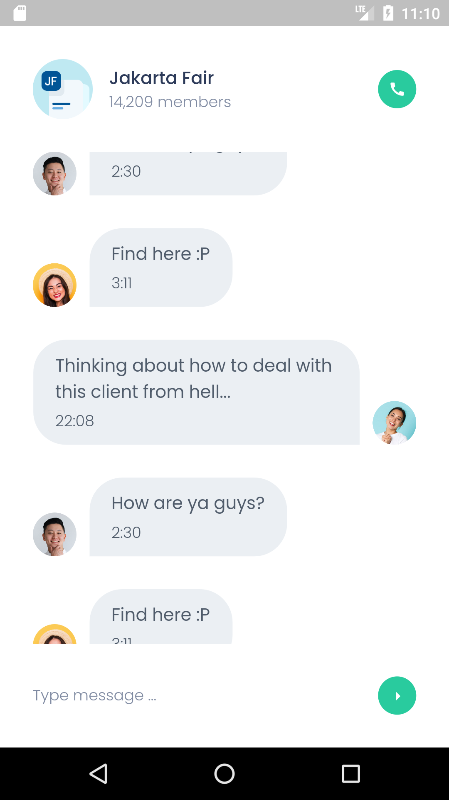

# BWA Chatty Project

A Flutter project slicing design form Build with Angga.

## :camera_flash: Screeshoot
- Home Page
- Chat Page

## Contribution
Thanks to [BuildwithAngga](https://buildwithangga.com/) for providing a project, also my mentor [Rifki Eka](https://github.com/rifqieh) for the instruction & guidance

## Author
**Irwan Iskandar**
- You can reach me at [Email](mailto:irwniskndr@gmail.com?subject=Hi "Hi!")
- Or follow me at [Instagram](https://www.instagram.com/irwnriskndr/)

## :love_letter: Support
Contributions, issues, and feature requests are welcome!

Give a ⭐️ if you like this project!

## Getting Started

This project is a starting point for a Flutter application.

A few resources to get you started if this is your first Flutter project:

- [Lab: Write your first Flutter app](https://flutter.dev/docs/get-started/codelab)
- [Cookbook: Useful Flutter samples](https://flutter.dev/docs/cookbook)

For help getting started with Flutter, view our
[online documentation](https://flutter.dev/docs), which offers tutorials,
samples, guidance on mobile development, and a full API reference.
